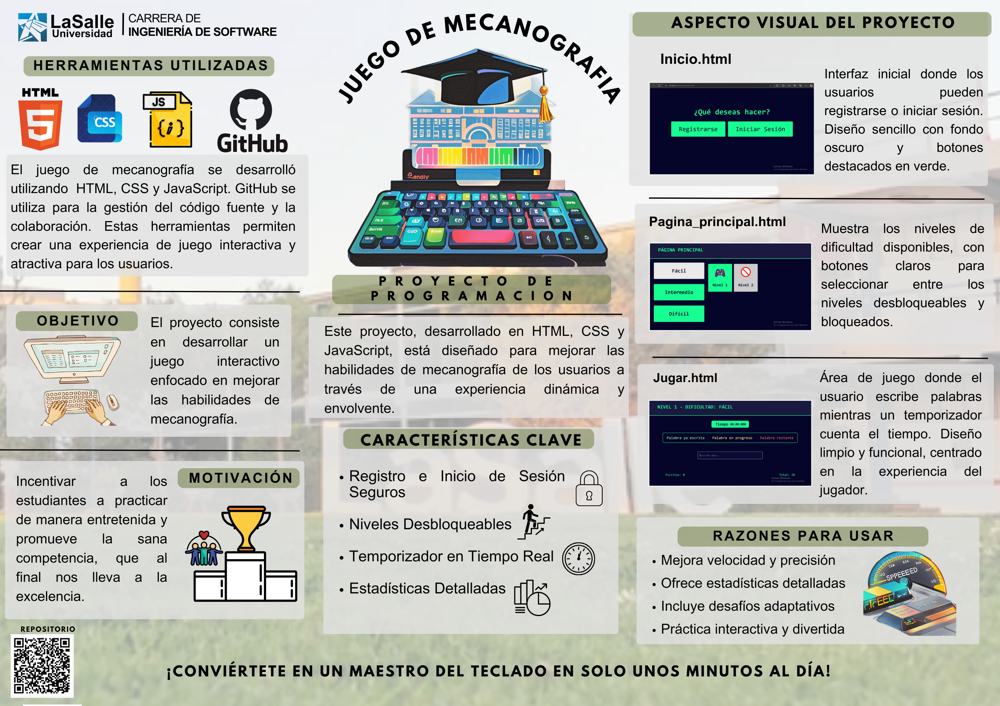

<div align="left">
    <table style="width: 80%; height: 400px; border: 1px solid #ddd; padding: 20px; text-align: center;">
        <thead>
            <tr>
                <td style="width: 150px;">
                    
                </td>
                <th style="text-align: left;">
                    <span style="font-weight: bold; font-size: 20px;">UNIVERSIDAD LA SALLE                    .</span><br />
                    <span style="font-weight: bold; font-size: 16px;">FACULTAD DE INGENIERÍA DE SOFTWAR  </span><br />
                </th>
            </tr>
        </thead>
        <tbody>
            <tr>
                <td colspan="2" style="text-align: center; padding-top: 20px; font-weight: bold;">Formato: Vectorcitos-Run Juego de Mecanografía</td>
            </tr>
            <tr>
                <td style="font-weight: bold;">Aprobación</td>
                <td>10/12/2024</td>
            </tr>
            <tr>
                <td style="font-weight: bold;">Página</td>
                                                                      <td>1</td>
            </tr>
        </tbody>
    </table>
</div>

<br />

<div align="left">
    <table style="width: 80%; height: 400px; border: 1px solid #ddd; padding: 20px;">
        <thead>
            <tr>
                <th colspan="6" style="text-align: center; font-size: 20px;">INFORMACIÓN BÁSICA</th>
            </tr>
        </thead>
        <tbody>
            <tr>
                <td style="font-weight: bold;">ASIGNATURA:</td>
                <td colspan="5">Lenguaje de Programación III</td>
            </tr>
            <tr>
                <td style="font-weight: bold;">TÍTULO:</td>
                <td colspan="5">Examen Final</td>
            </tr>
            <tr>
                <td style="font-weight: bold;">NÚMERO DE PRÁCTICA:</td>
                <td>01</td>
                <td style="font-weight: bold;">AÑO LECTIVO:</td>
                <td>2024B</td>
                <td style="font-weight: bold;">NRO. SEMESTRE:</td>
                <td>IV</td>
            </tr>
            <tr>
                <td colspan="6" style="font-weight: bold;">DOCENTES:</td>
            </tr>
            <tr>
                <td colspan="6">
                    <ul>
                        <li>Richart Smith Escobedo Quispe - rescobedoq@ulasalle.edu.pe</li>
                    </ul>
                </td>
            </tr>
            <tr>
                <td colspan="7" style="font-weight: bold;">INTEGRANTES:</td>
            </tr>
            <tr>
                <td colspan="6">
                    <ul>
                        <li>Piero Fabricio Poblete Andía - ppobletea@ulasalle.edu.pe</li>
                        <li>Katherine Naomi Saico Ccahuana - ksaicoc@ulasalle.edu.pe</li>
                        <li>Allison Mayra Usedo Quispe - ausedoq@ulasalle.edu.pe</li>
                        <li>Leonardo Raphael Pachari Gomez - lpacharig@ulasalle.edu.pe</li>
                        <li>Nicolle Andrea Lozano Vega - nlozanov@ulasalle.edu.pe</li>
                    </ul>
                </td>
            </tr>
        </tbody>
    </table>
</div>

# Juego de Mecanografia
El código está escrito en JavaScript y se utiliza para crear un juego de palabras que incluye un sistema de registro e inicio de sesión para los usuarios. Aquí hay una descripción de las secciones más importantes:

  1. Constantes Globales
  2. Clase User 
  3. Almacenamiento Simulado de Usuarios
  4. Funciones de Validación y Manejo de Usuarios
  5. Funciones del Juego
  6. Inicializar el Juego


# Estructura

## 1. Constantes Globales
```
const MAX_LOGIN_ATTEMPTS = 3;
const MIN_PASSWORD_LENGTH = 6;

```
Estas constantes definen reglas básicas para el sistema:

- **MAX_LOGIN_ATTEMPTS:** Número máximo de intentos fallidos de inicio de sesión antes de bloquear la cuenta.
- **MIN_PASSWORD_LENGTH:** Longitud mínima que debe tener una contraseña.

## 2. Clase *User*
```
class User {
    constructor(n, username, password, id, loginAttempts) {
        this.n = n;
        this.username = username;
        this.password = password;
        this.id = id;
        this.loginAttempts = loginAttempts;
        this.unlockedLevels = { easy: 1, medium: 0, hard: 0 };
    }
}

```

- **Clase User :** Define la estructura de un usuario. Cada usuario tiene un nombre, nombre de usuario, contraseña, un ID único, intentos de inicio de sesión y niveles desbloqueados.
- **unlockedLevels:** Un objeto que mantiene la cantidad de niveles desbloqueados por dificultad.

## 3. Almacenamiento Simulado de Usuarios
```
const users = {};
const texts = {
    easy: [
        "El sol brilla intensamente sobre el mar.",
        "Las olas susurran secretos.",
        "Las gaviotas vuelan en el cielo.",
        "El cielo es azul.",
        "Las flores son hermosas.",
        "La luna brilla en la noche.",
        "Los árboles susurran con el viento."
    ],
    medium: [
        "El viento sopla suavemente entre los árboles.",
        "Las estrellas iluminan la noche oscura.",
        "Los ríos fluyen con fuerza en primavera.",
        "La montaña se eleva majestuosamente.",
        "Los océanos son vastos e impresionantes."
    ],
    hard: [
        "La vida es un viaje lleno de sorpresas inesperadas.",
        "El conocimiento es poder y la curiosidad es la clave.",
        "Las experiencias nos moldean y nos definen.",
        "El arte es la expresión más pura del alma humana.",
        "La naturaleza nos ofrece belleza y serenidad."
    ]
};

```

- **users:** Un objeto que simula una base de datos para almacenar usuarios. Las claves son nombres de usuario y los valores son instancias de la clase *User* .
- **texts:** Un objeto que contiene listas de frases para cada nivel de dificultad. Cada dificultad tiene un conjunto de frases que el usuario debe escribir correctamente.

## 4. Funciones de Validación y Manejo de Usuarios
### Validación de Contraseña

```
function isValidPassword(password) {
    if (password.length < MIN_PASSWORD_LENGTH) {
        console.log(`La contraseña debe tener al menos ${MIN_PASSWORD_LENGTH} caracteres.`);
        return false;
    }
    return true;
}

```
- **isValidPassword:** Verifica que la contraseña cumpla con la longitud mínima.

### Verificación de Usuario
```
function usernameExists(users, username) {
    return users[username] !== undefined;
}

```
- **usernameExists:** Comprueba si un nombre de usuario ya está registrado.

### Verificación de Contraseña
```
function verifyPassword(user, password) {
    if (user.loginAttempts >= MAX_LOGIN_ATTEMPTS) {
        console.log("Cuenta bloqueada por múltiples intentos fallidos.");
        return false;
    }

    if (user.password === password) {
        user.loginAttempts = 0; // Resetear intentos al lograr acceso
        return true;
    } else {
        user.loginAttempts++;
        console.log(`Intentos restantes: ${MAX_LOGIN_ATTEMPTS - user.loginAttempts}`);
        return false;
    }
}

```
- **verifyPassword:** Comprueba si la contraseña ingresada coincide con la del usuario. Si hay un fallo, incrementa el contador de intentos.

### Registro de Usuario
```
function registerUser () {
    const username = prompt("Introduce tu nombre de usuario:");
    const password = prompt("Introduce tu contraseña:");

    if (username && password) {
        if (usernameExists(users, username)) {
            console.log("Este nombre de usuario ya está registrado. Por favor, elige otro.");
        } else {
            if (isValidPassword(password)) {
                users[username] = new User(Object.keys(users).length + 1, username, password, generateId(), 0);
                console.log("Registro exitoso. Ahora puedes iniciar sesión.");
            }
        }
    } else {
        console.log("Por favor, completa todos los campos.");
    }
}

```
- **registerUser :** Permite a un nuevo usuario registrarse. Solicita un nombre de usuario y contraseña, verifica si el nombre de usuario ya existe y si la contraseña es válida.

## 5. Funciones del Juego
### Menú Principal del Juego
```
function mainGameMenu(user) {
    let option;
    do {
        console.log(`\n=== Selecciona un nivel de dificultad ===`);
        console.log(`1. Fácil (Niveles desbloqueados: ${user.unlockedLevels.easy})`);
        console.log(`2. Medio (Niveles desbloqueados: ${user.unlockedLevels.medium})`);
        console.log(`3. Difícil (Niveles desbloqueados: ${user.unlockedLevels.hard})`);
        console.log(`4. Salir`);
        option = prompt("Selecciona una opción:");

        switch (option) {
            case '1':
                currentDifficulty = 'easy';
                selectLevel(user, currentDifficulty);
                break;
            case '2':
                currentDifficulty = 'medium';
                selectLevel(user, currentDifficulty);
                break;
            case '3':
                currentDifficulty = 'hard';
                selectLevel(user, currentDifficulty);
                break;
            case '4':
                console.log("Saliendo del juego...");
                break;
            default:
                console.log("Opción no válida. Intenta de nuevo.");
                break;
        }
    } while (option !== '4');
}

```
- **mainGameMenu:** Muestra un menú donde el usuario puede seleccionar la dificultad del juego. Dependiendo de la opción elegida, llama a selectLevel para permitir que el usuario seleccione un subnivel dentro de la dificultad elegida.


### Seleccionar Nivel
```
function selectLevel(user, difficulty) {
    let maxLevel = user.unlockedLevels[difficulty];
    if (maxLevel >= 5) {
        console.log(`Ya has completado todos los niveles de dificultad ${difficulty}.`);
        return;
    }

    let level = prompt(`Selecciona un subnivel (1-${maxLevel + 1}):`);
    level = parseInt(level);

    if (level < 1 || level > maxLevel + 1) {
        console.log("Opción no válida. Debes seleccionar un nivel desbloqueado.");
        return;
    }

    console.log(`Has seleccionado el nivel ${level} de dificultad ${difficulty}.`);
    currentLevel = level; // Guardar el nivel actual
    startGame(difficulty, level);

    // Si el nivel seleccionado es el último de la dificultad, desbloquear el siguiente nivel
    if (level === maxLevel + 1) {
        user.unlockedLevels[difficulty]++;
        console.log(`¡Felicidades! Has desbloqueado el nivel ${user.unlockedLevels[difficulty] + 1} de dificultad ${difficulty}.`);
    }
}

```
- **selectLevel:** Permite al usuario elegir un subnivel dentro de la dificultad seleccionada. Si el usuario ha completado todos los niveles, se le informa. Si el nivel es válido, se inicia el juego con *startGame*.
### Iniciar el Juego
```
function startGame(difficulty, level) {
    const text = texts[difficulty][level - 1];
    const words = text.split(" "); // Separamos el texto en palabras
    totalWords = words.length; // Total de palabras para completar el nivel
    wordCount = 0; // Palabras correctas
    incorrectWords = []; // Almacena las palabras incorrectas
    startTime = new Date();

    console.log(`\n=== Información del Juego ===`);
    console.log(`Texto a escribir: "${text}"`);
    console.log(`Cantidad de palabras: ${totalWords}`);

    let option;
    do {
        option = prompt(`Selecciona una opción:\n1. Jugar\n2. Volver a la página principal\n3. Salir`);
        switch (option) {
            case '1':
                playGame(words, 0); // Comenzamos desde la primera palabra
                break;
            case '2':
                return; // Volver a la página principal
            case '3':
                console.log("Saliendo del juego...");
                break;
            default:
                console.log("Opción no válida. Intenta de nuevo.");
                break;
        }
    } while (option !== '3');
}

```
- **startGame:** Comienza el juego. Toma el texto correspondiente al nivel y lo divide en palabras. Luego muestra la información del juego y permite al usuario elegir entre jugar, volver al menú principal o salir.

### Jugar el Juego
```
function playGame(words, currentWordIndex) {
    if (currentWordIndex < totalWords) {
        const targetWord = words[currentWordIndex];
        const userInput = prompt(`Escribe la palabra ${currentWordIndex + 1} de ${totalWords}: "${targetWord}"`);

        if (userInput === targetWord) {
            wordCount++;
            console.log(`Palabra correcta: "${targetWord}"`);
        } else {
            console.log(`Palabra incorrecta: "${userInput}". La palabra correcta era: "${targetWord}"`);
            incorrectWords.push(userInput); // Guardar palabra incorrecta
        }

        // Continuar con la siguiente palabra
        playGame(words, currentWordIndex + 1);
    } else {
        endGame();
    }
}

```
- **Descripción**
    - Esta función se llama para que el jugador escriba las palabras.
    - **words:** Es un array que contiene las palabras del texto que el jugador debe escribir.
    - **currentWordIndex:** Indica la posición actual de la palabra que el jugador debe escribir.

- **Comportamiento:**
    - Si el índice actual es menor que el total de palabras, se obtiene la palabra objetivo *(targetWord)* y se le pide al jugador que la escriba.
    - Si la entrada del jugador *(userInput)* coincide con *targetWord*, se incrementa el contador de palabras correctas *(wordCount)*.
    - Si no coincide, se muestra un mensaje de error y se guarda la palabra incorrecta en *incorrectWords*.
    - Luego, la función se llama a sí misma recursivamente para procesar la siguiente palabra.
    - Cuando se han escrito todas las palabras, se llama a *endGame*.

### Finalizar el Juego
```
function endGame() {
    const endTime = new Date();
    const elapsedTime = Math.floor((endTime - startTime) / 1000);
    console.log(`¡Nivel completado!`);
    console.log(`Tiempo total: ${Math.floor(elapsedTime / 60)}:${elapsedTime % 60}`);
    displayResults();
}

```
- Esta función se llama al final del juego, una vez que el jugador ha completado todas las palabras.
- Calcula el tiempo total transcurrido desde que comenzó el juego y lo muestra en minutos y segundos.
- Luego, llama a *displayResults* para mostrar los resultados del jugador.
### Mostrar Resultados
```
function displayResults() {
    console.log(`Total de palabras: ${totalWords}`);
    console.log(`Palabras correctas: ${wordCount}`);
    console.log(`Palabras incorrectas: ${totalWords - wordCount}`);

    if (incorrectWords.length > 0) {
        console.log("Palabras incorrectas:");
        incorrectWords.forEach((word, index) => {
            console.log(`${index + 1}: ${word}`);
        });
    } else {
        console.log("¡No hubo palabras incorrectas!");
    }

    // Calcular y mostrar estrellas en función de la precisión
    const incorrectCount = totalWords - wordCount;
    const errorPercentage = (incorrectCount / totalWords) * 100;
    let stars = 0;

    if (errorPercentage > 66) {
        stars = 1; // Más del 66% de errores
    } else if (errorPercentage > 33) {
        stars = 2; // Más del 33% y hasta 66% de errores
    } else {
        stars = 3; // Menos del 33% de errores
    }

    console.log(`Calificación: ${stars} ${'⭐'.repeat(stars)}`);

    // Opciones después de completar el nivel
    let option;
    do {
        option = prompt(`Selecciona una opción:\n1. Volver a jugar el mismo nivel\n2. Ir al siguiente nivel\n3. Ir a la página principal\n4. Salir`);
        switch (option) {
            case '1':
                // Volver a jugar el mismo nivel
                console.log("Reiniciando el nivel...");
                startGame(currentDifficulty, currentLevel);
                break;
            case '2':
                // Avanzar al siguiente nivel
                advanceToNextLevel(currentDifficulty);
                break;
            case '3':
                // Volver a la página principal
                return;
            case '4':
                console.log("Saliendo del juego...");
                break;
            default:
                console.log("Opción no válida. Intenta de nuevo.");
                break;
        }
    } while (option !== '4');
}

```
Después de mostrar los resultados, el jugador tiene varias opciones:
- **Volver a jugar el mismo nivel:** Reinicia el nivel actual llamando a startGame con la dificultad y el nivel actuales.
- **Ir al siguiente nivel:** Llama a advanceToNextLevel para avanzar al siguiente nivel de dificultad.
- **Ir a la página principal:** Regresa al menú principal del juego.
- **Salir:** Termina el juego.

### Avanzar al siguiente nivel
```
function advanceToNextLevel(difficulty) {
    const nextLevel = currentLevel + 1;
    const maxLevel = user.unlockedLevels[difficulty];

    if (nextLevel > maxLevel + 1) {
        console.log(`Ya has completado todos los niveles de dificultad ${difficulty}.`);
        return;
    }

    console.log(`Avanzando al nivel ${nextLevel} de dificultad ${difficulty}...`);
    startGame(difficulty, nextLevel);
}

```
Esta función permite al jugador avanzar al siguiente nivel dentro de la misma dificultad.
- Comprueba si el siguiente nivel está disponible y, si es así, llama a *startGame* con el nuevo nivel.

## 6. Inicializar el Juego

Finalmente, necesitamos una función para inicializar el juego y comenzar desde el menú principal:

```
function initGame() {
    console.log("Bienvenido al juego de palabras!");
    mainGameMenu(user); // Iniciar en el menú principal
}

// Llamar a la función de inicialización para comenzar el juego
initGame();

```
- **initGame:** Función que da la bienvenida al jugador y llama al menú principal para que el jugador pueda comenzar a jugar.

# Conclusión
Con todas estas funciones y estructuras, hemos creado un juego interactivo donde los jugadores pueden seleccionar niveles de dificultad, escribir palabras y recibir retroalimentación sobre su desempeño. El juego permite a los jugadores avanzar y desbloquear nuevos niveles, lo que lo hace más atractivo y desafiante.

## Participación de los Integrantes 

| Integrantes | Participación % |
|-----------|-------------|
| Piero Fabricio Poblete Andía        |     100%  |
| Katherine Naomi Saico Ccahuana         | 100%     |
| Allison Mayra Usedo Quispe         | 100%      |
| Leonardo Raphael Pachari Gomez         | 100%     |
| Nicolle Andrea Lozano Vega         | 100%     |



